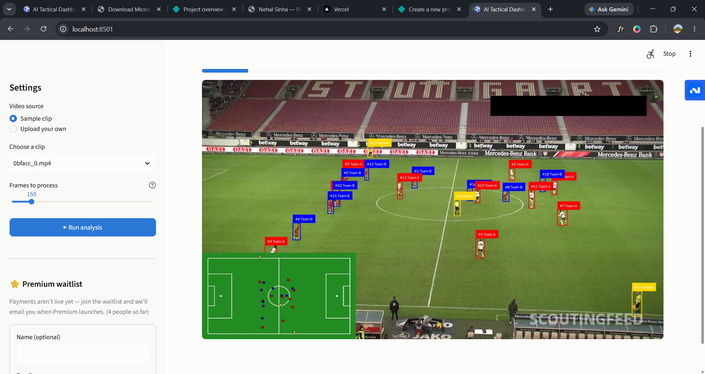
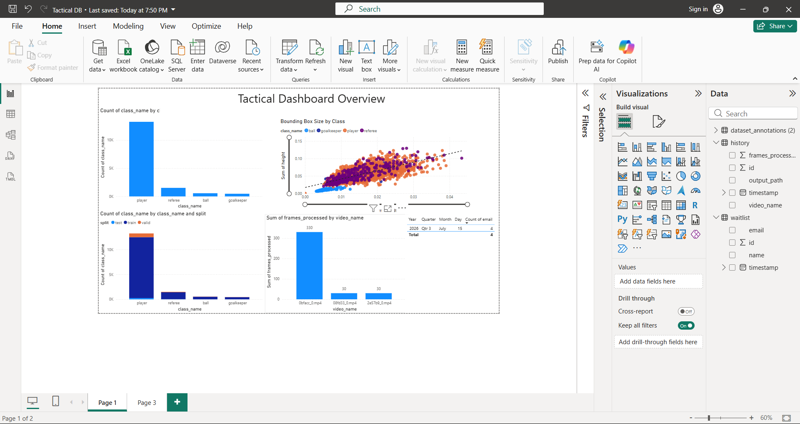

# ⚽ TacticEye

An end-to-end soccer analytics pipeline: a custom-trained YOLOv8 object detector feeds
multi-object tracking, unsupervised team classification, and homography-based
tactical (top-down) visualization — wrapped in an interactive Streamlit app.

## What it does

- **Detects** players, goalkeepers, referees, and the ball in match footage using a
  YOLOv8 model trained from scratch on a [Roboflow Universe](https://universe.roboflow.com/roboflow-jvuqo/football-players-detection-3zvbc) dataset (not a pretrained/off-the-shelf model).
- **Tracks** each detection across frames with ByteTrack, giving every player a
  persistent ID instead of independent per-frame boxes.
- **Classifies players into two teams** via unsupervised KMeans clustering on jersey
  color, with HSV-based grass exclusion so the pitch background doesn't contaminate
  the color signal.
- **Computes a live homography** from a separate pretrained pitch-keypoint model to
  project player positions from the camera view onto a flat, top-down tactical radar.
- **Serves it all through a Streamlit app** with live frame-by-frame streaming
  (rather than waiting on a fully encoded video), run history, and an analytics
  dashboard.
- **Feeds a Power BI report** built from exported dataset/model/usage CSVs, tying
  dataset composition directly to model performance (see screenshot below).

## Screenshots




## Architecture

```
video frame
   ├─► player/ball/ref detector (custom-trained YOLOv8) ─► ByteTrack ─► team KMeans
   └─► pitch keypoint detector (pretrained)  ─► homography ─► radar projection
                                     both combine into the annotated output frame
```

**Built from scratch here:** the player/ball/referee/goalkeeper detector (trained on
this repo's dataset), the team-classification logic, and the whole Streamlit app
(live streaming UI, history, analytics, waitlist).

**Integrated, not reinvented:** the pitch-keypoint detection model and the
homography/pitch-drawing utilities come from Roboflow's open-source
[`sports`](https://github.com/roboflow/sports) repo — building a from-scratch pitch
keypoint model was out of scope (would need its own multi-hour training run on a
separate dataset), so the pretrained one is used directly for that piece.

## Model performance (held-out test set)

| Class | Precision | Recall | mAP50 |
|---|---|---|---|
| **All** | 0.86 | 0.77 | **0.77** |
| Ball | 1.00 | 0.26 | 0.30 |
| Goalkeeper | 0.87 | 1.00 | 0.97 |
| Player | 0.88 | 0.96 | 0.97 |
| Referee | 0.68 | 0.88 | 0.85 |

Overall mAP50-95: 0.49. Trained for 100 epochs (YOLOv8n) on CPU.

**Known limitation:** ball detection is noticeably weaker than the other classes
(mAP50 0.30). This is a well-known hard case in sports CV — the ball is small,
fast-moving, and frequently motion-blurred or occluded — rather than a bug in the
pipeline. Homography accuracy also varies frame-to-frame since it's computed
independently per frame (no temporal smoothing yet — see Limitations below).

## Setup

```bash
pip install -r requirements.txt
pip install git+https://github.com/roboflow/sports.git
```

Download sample match footage and the pretrained pitch-keypoint model:

```bash
python -m gdown -O sports/examples/soccer/data/football-pitch-detection.pt "https://drive.google.com/uc?id=1Ma5Kt86tgpdjCTKfum79YMgNnSjcoOyf"
python -m gdown -O sports/examples/soccer/data/0bfacc_0.mp4 "https://drive.google.com/uc?id=12TqauVZ9tLAv8kWxTTBFWtgt2hNQ4_ZF"
```

Run the dashboard:

```bash
python -m streamlit run dashboard.py
```

Or run the standalone scripts directly:

```bash
python detect_video.py   # detection + tracking + team boxes -> outputs/detected.mp4
python radar.py           # adds pitch homography + radar inset -> outputs/radar.mp4
```

## Limitations / honest notes

- Team classification is a simple color-clustering heuristic (KMeans on jersey
  color), not a learned model — works well when kits are visually distinct, degrades
  if a team's kit is close in color to the pitch itself.
- Homography is recomputed independently each frame; there's no Kalman-style
  temporal smoothing, so the radar view can jitter on frames with few confidently
  detected pitch keypoints.
- Payment integration (Stripe) is wired up in code but disabled by default
  (`PAYMENTS_ENABLED = False` in `dashboard.py`) — a waitlist form collects interest
  in the meantime.

## Tech stack

Python, Ultralytics YOLOv8, OpenCV, Supervision, ByteTrack (via the `trackers`
package), scikit-learn, Streamlit, SQLite, Stripe.

## License

- The detector code and training pipeline here: MIT (or your preferred license).
- YOLOv8 (Ultralytics): [AGPL-3.0](https://github.com/ultralytics/ultralytics/blob/main/LICENSE).
- `sports` (Roboflow): [MIT](https://github.com/roboflow/supervision/blob/develop/LICENSE.md).
- Training dataset: [CC BY 4.0](https://universe.roboflow.com/roboflow-jvuqo/football-players-detection-3zvbc), Roboflow Universe.
